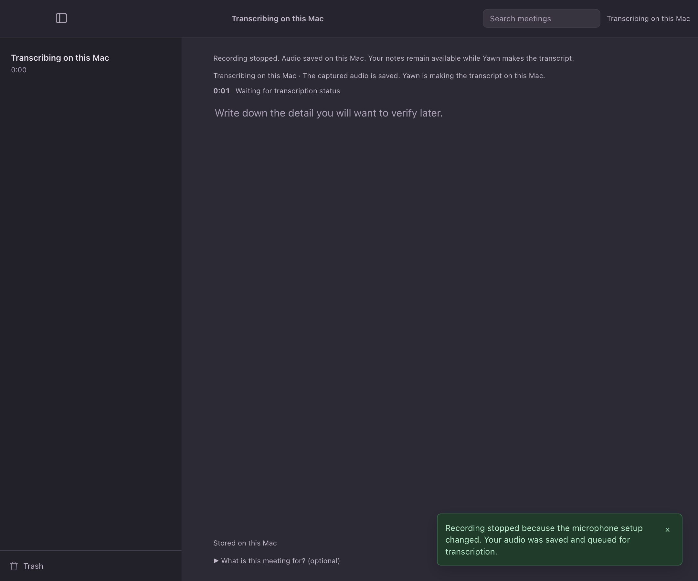
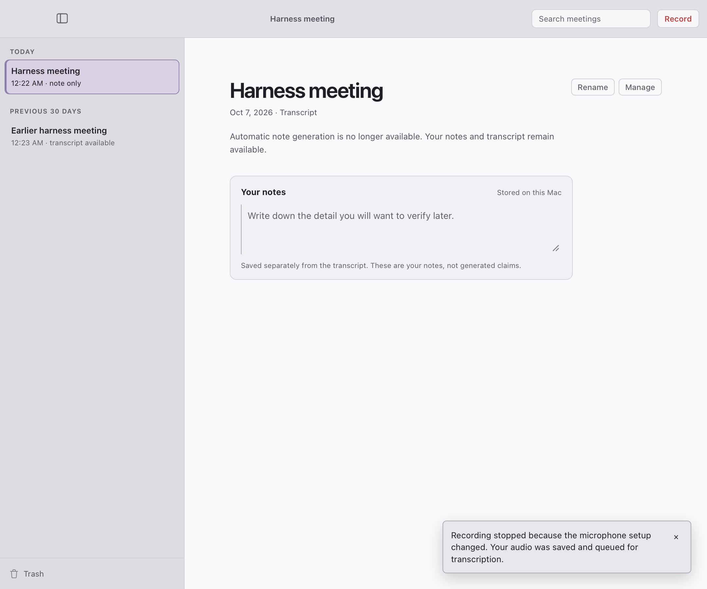
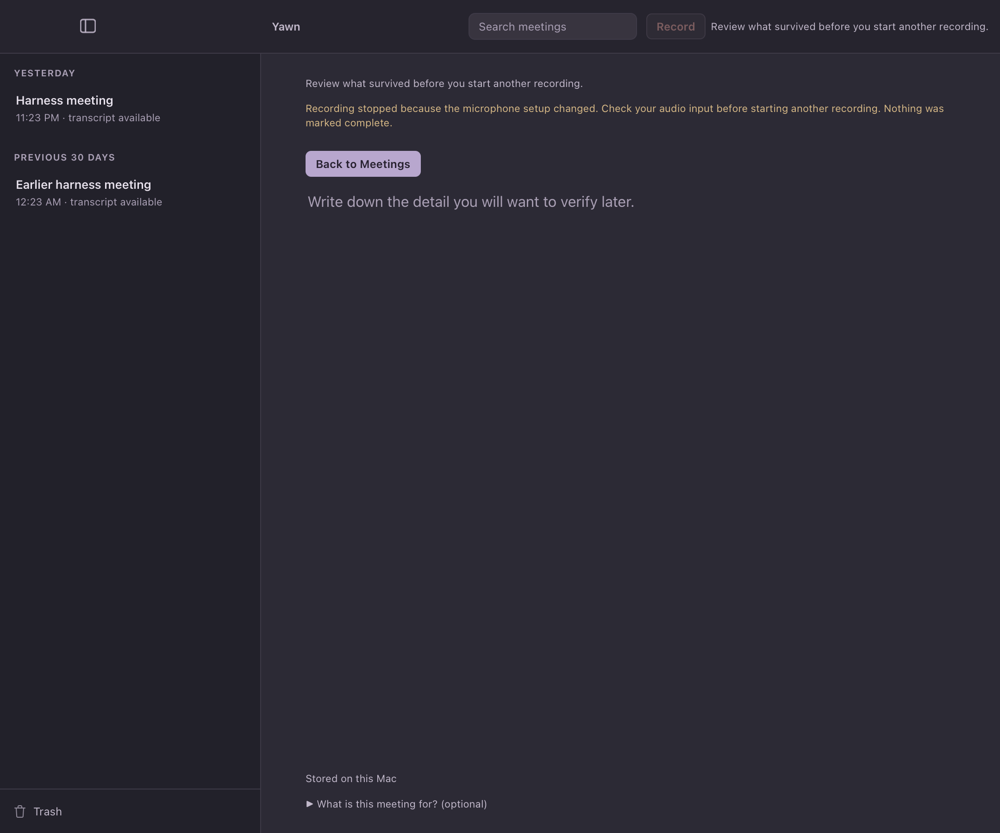
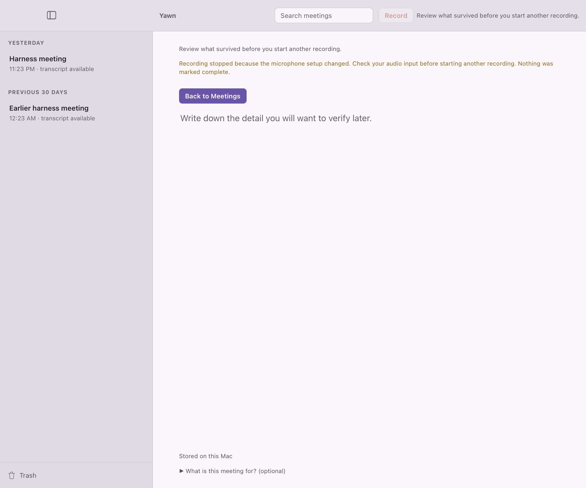
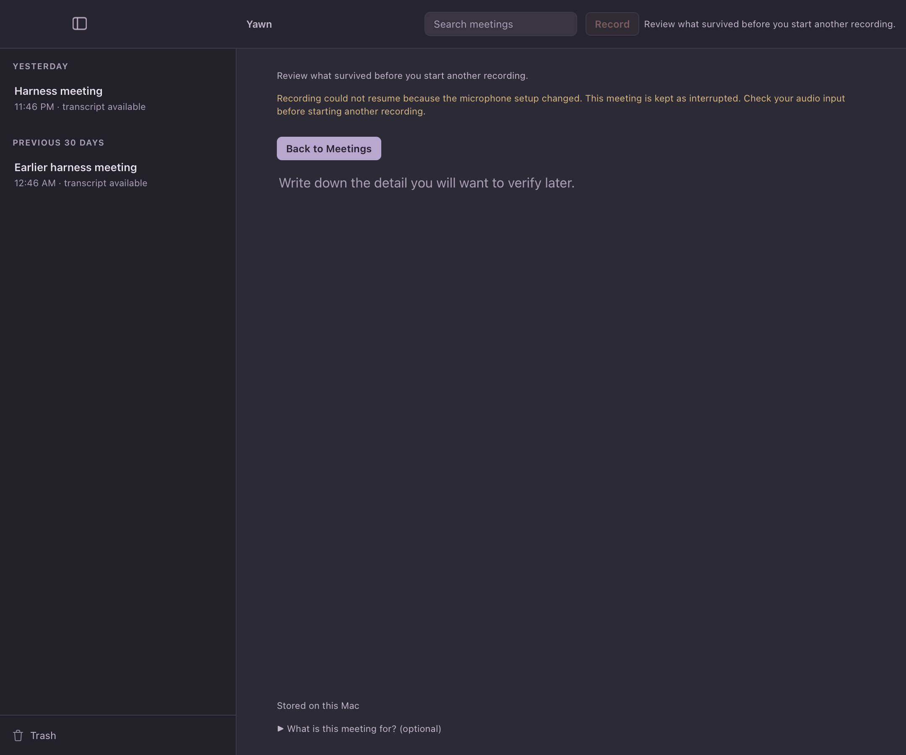
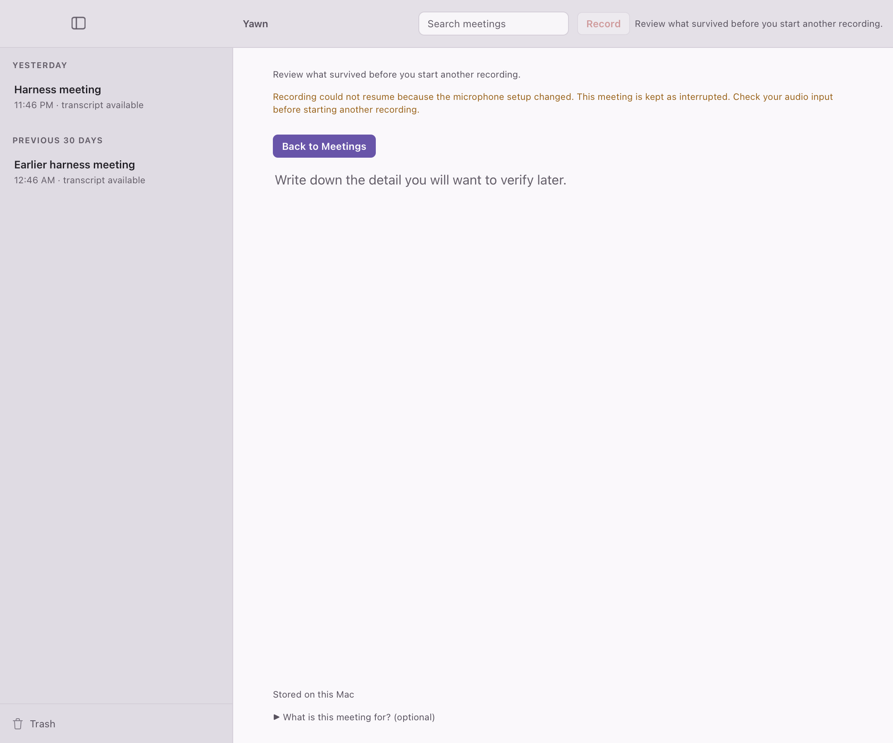

# Recording stopped by a microphone setup change — cold review, 2026-10-07

**Kind:** cold screen review, three passes. Each pass used a fresh reviewer who saw only four rendered frames and the questions below, with no source code, no design rationale and no description of the fix. The frames come from the synthetic WKWebView harness (`ui-harness/run.sh mic-change`, modes `mic-change-stop` and `mic-change-failed`), which drives the production frontend against a stubbed backend using the backend's copy verbatim. They are not captures of the installed app, and no real microphone change occurred.

**Questions:** Situation A — the person was recording "Harness meeting" and did not press Stop; this is the screen moments later. Situation B — the person had just pressed Record to start a new meeting; this is the screen moments later. For each: what happened, is the audio saved and how sure can they be, what happens next and what must they do, what is confusing, contradictory, alarming, easy to miss or redundant, and is every message readable in dark and light.

| Pass | Frames | Verdict | Main finding |
|---|---|---|---|
| 1 (superseded) | A stubbed as "transcribing" with the capture pane still shown; B with an empty library | revise / revise | Judged a state the backend never produces: after any finalized take it steps Captured → Idle and clears the meeting projection. Caught by the automated commit review. Its findings are not carried forward. |
| 2 | A as the real idle state: the just-recorded meeting opens with no transcript yet (the reader's default `transcript-only` branch), background transcription active; B with a populated library and a new meeting id | revise / revise | See below |
| 3 | B and new situation C (change while resuming) with the reworded failure lines below | revise / revise | The new wording works; remaining findings are on the existing interrupted screen. See below |

**Pass 2, situation A** — new copy: toast "Recording stopped because the microphone setup changed. Your audio was saved and queued for transcription."
- The reviewer read the audio as saved and the next step as automatic.
- Attributable to this change: the toast is the only place the cause appears, and it is dismissible.
- Not introduced by this change, but made more visible by it: the meeting page for a still-queued take says "Automatic note generation is no longer available. Your notes and transcript remain available.", its caption reads "Transcript", and the sidebar row reads "note only" — while no transcript exists yet. A normal Stop lands on the same page. Suggested: while transcription is pending, show a status such as "Transcribing your saved audio. It will appear here when ready."

**Pass 2, situation B** — new copy: context line "Recording stopped because the microphone setup changed. Check your audio input before starting another recording. Nothing was marked complete."
- Attributable to this change: "Recording stopped" describes a recording that never started (the change came while arming), and "Nothing was marked complete." does not say whether any audio exists. Suggested: "Recording did not start because the microphone setup changed. No audio was captured. Check your input, then press Record." The same message is also used when a paused recording cannot resume, where "stopped" fits, so the wording choice covers both.
- Not introduced by this change: "Review what survived before you start another recording." shown twice, the disabled Record button, and the near-empty interrupted page.

**Operator decisions, 2026-10-07** (taking the implementer's recommendations): (1) keep the cause in the toast only — the audio is safe and the reviewer read it so; (2) give the two failure paths their own wording, below, departing from the shared "Nothing was marked complete." ending; (3) fix the queued-meeting page in a separate change, since it affects every stop.

**Pass 3** — reworded failure lines (the backend now picks by path; the arming path previously shared the resume message):
- B, change while arming: "Recording did not start because the microphone setup changed. No audio was captured. Check your audio input, then press Record." The reviewer was sure no audio exists and knew the next step. Accepted in substance; verdict revise only for the existing screen around it.
- C, change while resuming a paused take: "Recording could not resume because the microphone setup changed. This meeting is kept as interrupted. Check your audio input before starting another recording." The reviewer could not tell whether audio from before the pause is safe. That is deliberate: the take's audio stays unpromoted on this path, and what recovery does with it was not verified, so the line makes no claim. Open question for a follow-up.
- Not introduced by this change: "Review what survived before you start another recording." (contradicts "No audio was captured" in B, and appears twice), the unlabeled notes prompt and "What is this meeting for?" on a failed start, and the dimmed Record button — all the existing interrupted-capture screen.

**Transient, from code, not yet observed on a device:** a meeting record is created with lifecycle `RecoveredInterrupted` and only changes when a take finalizes, so after any capture failure the library lists the meeting as interrupted and the UI replaces the capture pane with that meeting's page ("This meeting did not finish. Review what survived before you start another recording."), which does not carry the failure's cause. The lines in B and C — like every capture failure message before them — are therefore visible until the library catches up, roughly one snapshot poll. Belongs with decision 3's follow-up.

Harness artifacts, not findings: sidebar times are synthetic (an "earlier" meeting can show a later clock time); the meeting is named "Harness meeting".

All messages were judged readable in both themes.

What was removed, combined, demoted or hidden: nothing. The change adds one notice (A) and two failure messages (B, C). Before it, situation A was a failed recording whose audio was not saved, with a generic message.

Checks: `./run.sh mic-change` passed all three modes in dark and light; `microphone_change_messages_say_what_happened_to_the_audio` pins both wordings to their paths. The `mic-change-stop` mode failed with `main`'s `ui/main.js` (the notice never appeared) and passed with this change, each on a harness port not used before. At the time the runner kept a persistent WebKit cache, and a reused port could serve a stale `main.js`. Since #88 it keeps nothing between launches and stops with `STALE PAGE` when a page does not match the current launch, so the port no longer matters. The queued-meeting page is stubbed from the reader code (`library_reader.rs` default branch), not observed in an installed build. This review does not establish behavior during a real call.
