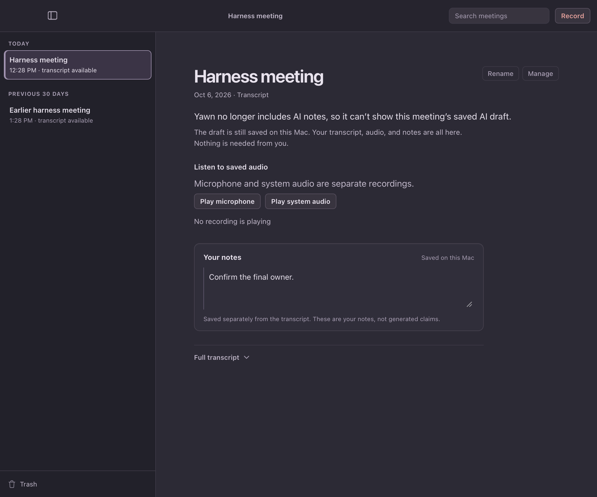
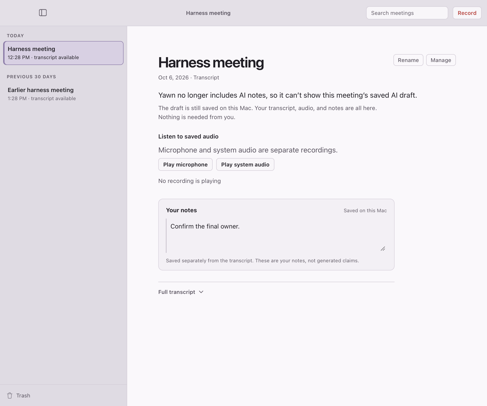

# Withheld saved AI draft — cold review, 2026-10-06

**Kind:** cold screen review, four passes. Passes 1, 3 and 4 each used a fresh reviewer who saw only the rendered frames and the job questions, with no source code and no design rationale. Pass 2 was not fully cold: the same reviewer as pass 1 was also told why the wording was chosen. Pass 2's accept is therefore superseded by the fresh passes after it. The frames come from the synthetic WKWebView harness (`ui-harness/run.sh note-retirement`, mode `saved-draft-unreadable`), which drives the production frontend against a stubbed backend. They are not captures of the installed app.

**Question:** When a meeting has a saved AI draft that this install cannot read, can a person tell what the meeting has and what it doesn't show? Does anything suggest the draft was lost?

| Pass | Lead line / detail / caption | Verdict | Main finding |
|---|---|---|---|
| 1 | "…saved AI draft that this version of Yawn can't show." / "The transcript and your notes remain available." / "Saved AI draft" | revise | Dead end; no word on whether the draft is safe |
| 2 (not cold) | detail adds "The draft is still saved on this Mac." | accept | — |
| 3 | same as 2 | revise | "this version" implies an update fixes it, and none does; "Saved" means three different things on one screen |
| 4a | "…that Yawn can no longer show." / caption "AI draft not shown" | revise | No cause or next step; the caption repeats the headline |
| 4b (shipped) | "Yawn no longer includes AI notes, so it can't show this meeting's saved AI draft." / "The draft is still saved on this Mac. Your transcript, audio, and notes are all here. Nothing is needed from you." / caption "Transcript" | revise | Leads with what can't be shown rather than what the meeting has; "Transcript" undersells a meeting with audio and notes |

**Status: not accepted.** The passes stopped converging. Each fix for one reviewer's concern drew the opposite concern from the next. Every pass agreed that nothing on the screen suggests deletion, and that the transcript, audio and notes are reachable. Choosing the lead sentence is an operator wording decision. It is recorded as open in DIRECTION.md content reads. The strongest remaining candidate, from pass 4b, is to lead with what the meeting has and demote the AI-draft sentence to the detail line.

Not changed, with reasons: the collapsed "Full transcript" row, the "Manage" label, the idle "No recording is playing" line, and the audio caption's size. All four were raised across passes, but every meeting state shares them, so this change did not introduce them.

What was removed, combined, demoted or hidden: nothing was removed. This state replaces a whole-library failure ("The local library is unavailable"), which hid every meeting.

Checks: `npm run test:ui` (156 pass). `./run.sh note-retirement` passed all five fixtures in dark and light. The new fixture passes only when the withheld-draft note area and the audio controls are present. This review does not establish behavior in an installed build.
