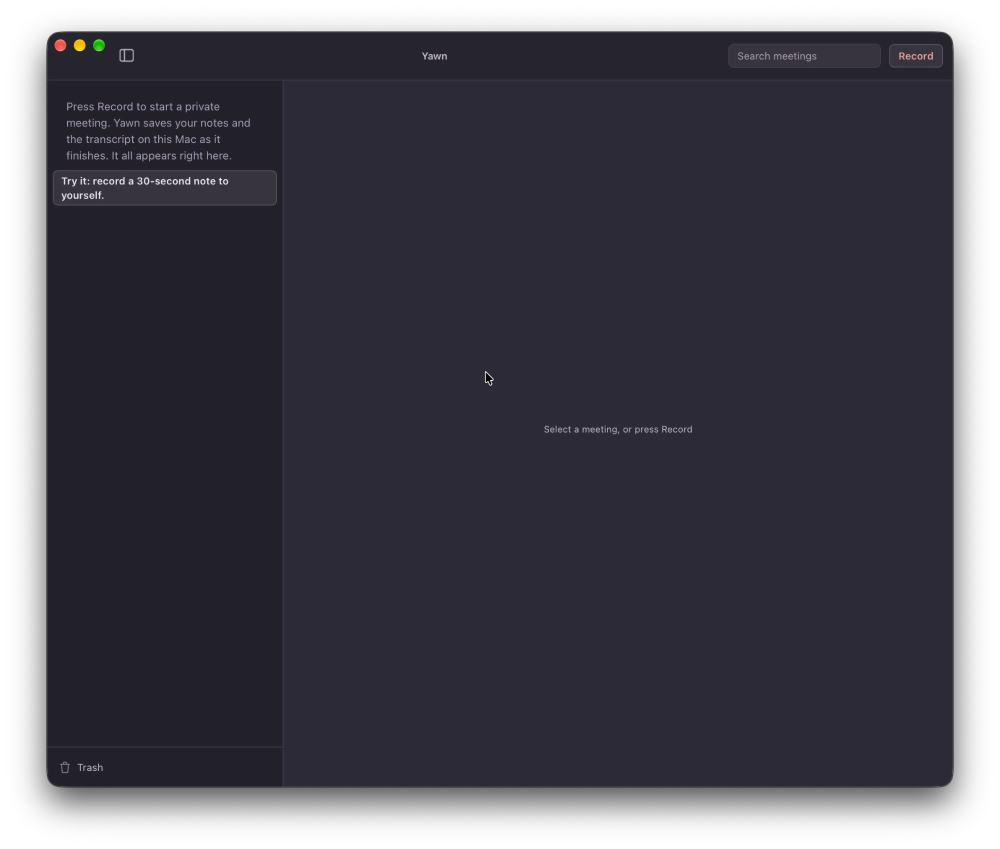
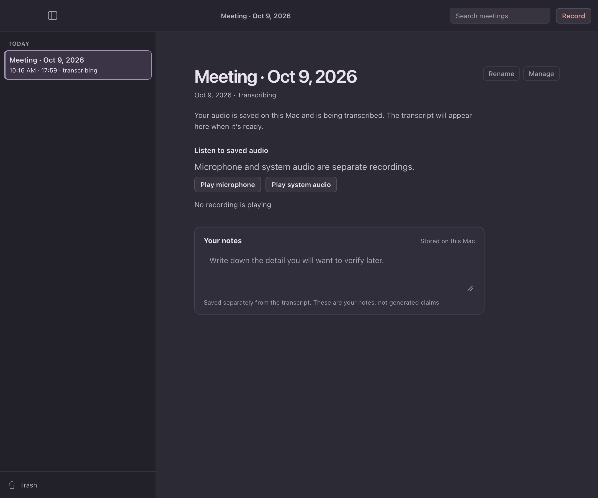
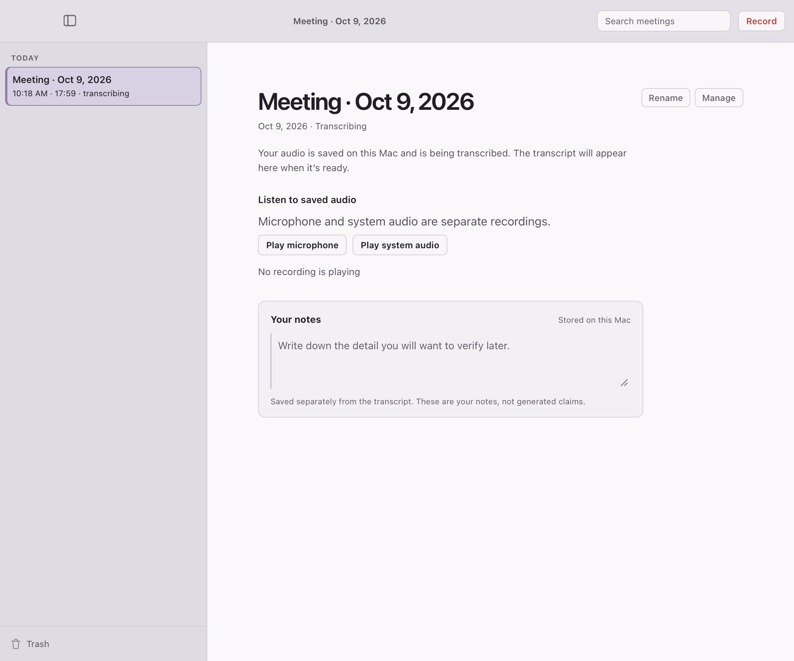

# What the window shows right after Stop — cold review, 2026-10-09

**Kind:** cold screen review, one pass. The reviewer was a fresh subagent. It saw only two rendered frames (dark and light, unlabeled, renamed `frame-1` and `frame-2`) and five neutral job questions. It had no source code and no rationale. It was told only that the frames show a Mac app for recording meetings, and that the person has just pressed Stop. The frames come from the synthetic WKWebView harness (`ui-harness/run.sh stop-lands`), which drives the production frontend against a stubbed backend. They are not captures of the installed app.

**Question:** A person has just pressed Stop. Can they tell where their recording is, whether the audio is safe, and what happens next?

**Before (installed 0.6.10, reported 2026-10-09):** after Stop, the window went home on the library it had read before the recording began. In the report that library was empty, so the sidebar showed the first-run "Press Record" prompt and the canvas said "Select a meeting, or press Record". The 18-minute meeting and its transcript were on disk the whole time. They appeared only after the app was quit and reopened. Frame: `docs/evidence/stop-lands-2026-10-09/before-installed-0.6.10.png` (the person's own screenshot).

**Cause:** once the take is queued, the backend steps the capture Captured -> Idle and clears the meeting projection (`main.rs`, after enqueue). `refreshSnapshot` switches the view home on that idle, and nothing reads the library again. The 2026-10-07 transcribing refresh does not cover this, because it waits on a row that already says `transcriptPending`, and here there was no row at all. The library reader itself is correct: `validate_snapshot_excluding` rebuilds from disk, so any read after the capture released the meeting would have listed it. A read in the short window while the capture still holds it leaves the meeting out, which is why the fix retries rather than reading once.

**Fix:** `refreshSnapshot` keeps the id of a meeting whose capture ended by itself. The poll then re-reads the library until that meeting's row is there, then opens it the way a click would. The re-reads back off and stop after six tries, or after one while a sidebar search is filtering the list (clearing the search reads the whole library again). If another meeting was opened during the recording, it stays open: the library and that meeting are re-read together, keeping any unsaved typing, which is the same step the transcribing refresh already took (now one shared helper, guarded so the two background refreshes never run at once).

| Pass | Verdict | Main finding |
|---|---|---|
| 1 (cold, after) | pass | Finds the recording in the sidebar under Today, marked "transcribing", and open as the page. Reads "Your audio is saved on this Mac and is being transcribed" as the safety statement, and "The transcript will appear here when it's ready" as nothing needed from them |

Raised but not changed, with reasons: "No recording is playing" blurs playback with recording. "Microphone and system audio are separate recordings" is set larger than its heading and reads as a warning. "Manage" is unexplained. The default "Meeting · <date>" title is hard to find among many. There is no time estimate, and nothing says whether closing the window or starting another recording is safe while it transcribes. The first three were also raised on 2026-10-07. Every meeting state shares them, so this change did not introduce them. The start time differs between the two frames (10:16 and 10:18 AM) because the harness stamps the row two minutes apart for each capture. That is a fixture artifact.

What was removed, combined, demoted or hidden: nothing. The page shown is the one reviewed on 2026-10-07, with the same copy. What changed is which screen follows Stop: the just-recorded meeting instead of a library read before it existed.

Checks: `npm run test:ui` (162 pass). `./run.sh stop-lands` passes both variants. The plain one has 2 library reads after Stop and none once the meeting is open. In the `&selected=1` variant an earlier meeting is selected during the recording: the new meeting is listed and the earlier one stays open. Run against main's UI (63fbc47) in a scratch worktree, both fail. The plain variant shows 0 library reads after Stop, the meeting never listed, and the "Press Record" prompt still up. The selected variant never lists the new meeting. `mic-change`, `transcribing-meeting`, `stop-status`, `capture` and `smoke` still pass. No Rust changed, so no cargo lane was run. This review does not establish behavior in an installed build.
