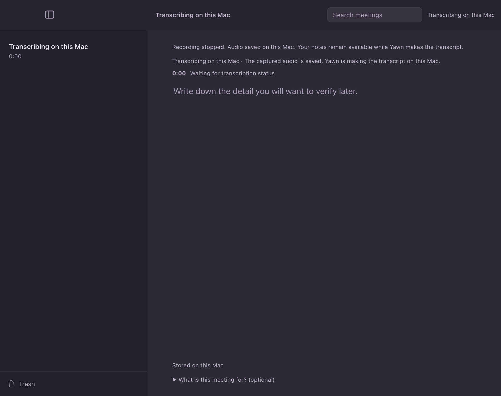

# Stop-recording status — cold review, 2026-09-29

**Kind:** cold screen review. The reviewer saw the rendered frame without source code or design rationale. The frame comes from a synthetic WKWebView harness using the production frontend and a stubbed capture state. It is not a capture of the installed app.

**Question:** After pressing Stop, can a person tell whether Yawn is still recording and whether the audio was saved?

The first frame removed the live badge and inactive Stop control, but the reviewer found that the remaining “Transcribing on this Mac” labels did not explicitly say recording had stopped. “Waiting for a confirmation on this Mac” also left the work being confirmed unclear.

The revised frame says “Recording stopped. Audio saved on this Mac.” before describing transcription. The reviewer confirmed that this resolves the stopped-versus-processing ambiguity and found no remaining misleading stop-state cue. The step timer starts at `0:00`; it times transcription, not recorded audio.

The harness drove the real frontend through live recording, Stop, stopping, and transcribing. It checked the toolbar title, sidebar status, recording controls, saved-audio message, and page errors. `npm run test:ui` and `./run.sh stop-status` passed. This review does not establish behavior in an installed replacement or a fresh real recording.
