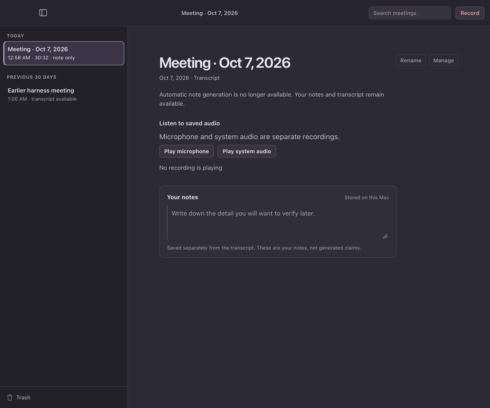
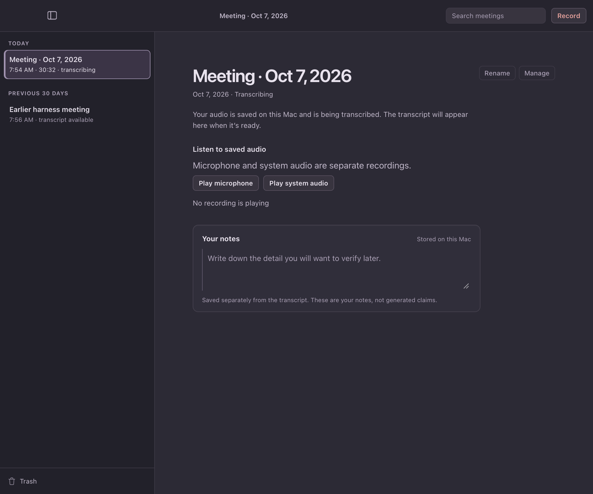
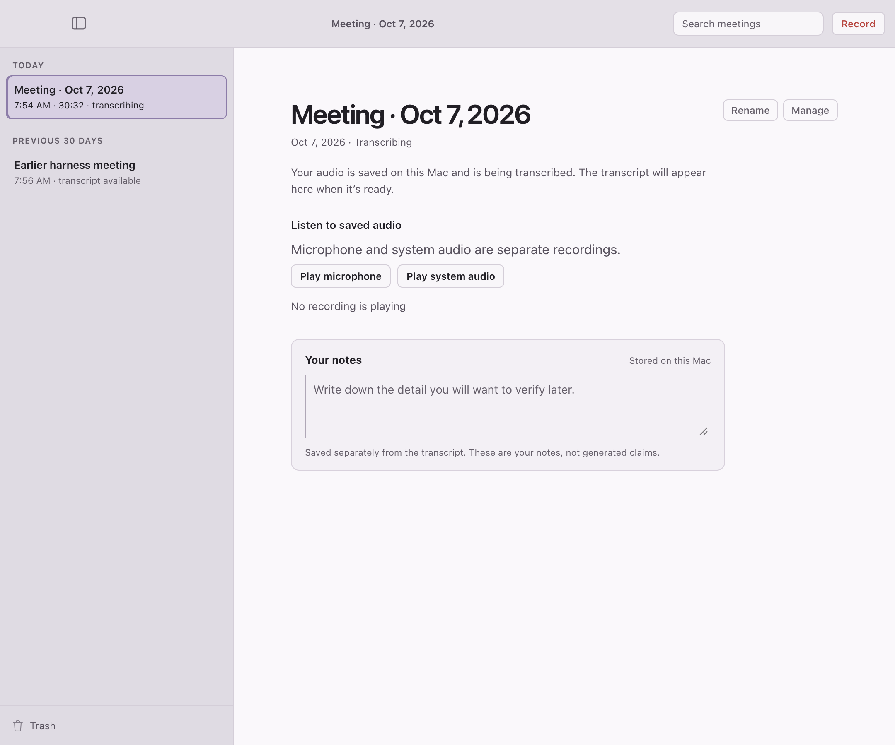
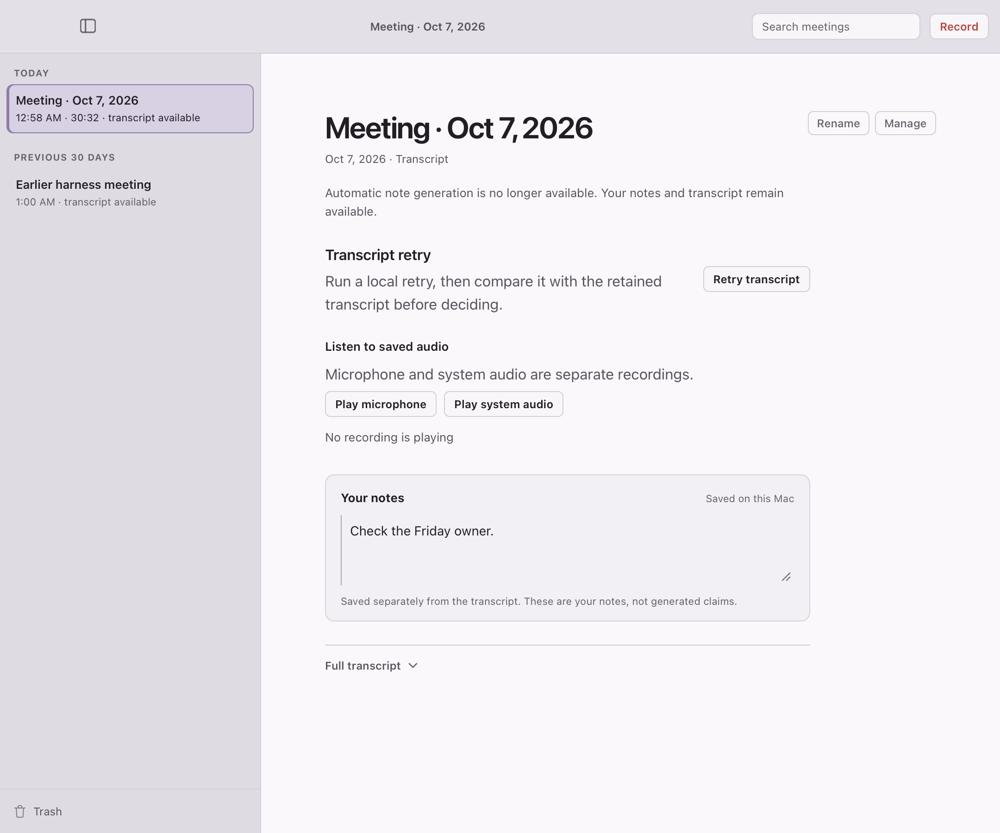

# Meeting page while its transcript is still being made — cold review, 2026-10-07

**Kind:** cold screen review, one pass. The reviewer was a fresh subagent that saw only two rendered frames (light and dark, unlabeled, renamed `frame-1` and `frame-2`) and six neutral job questions. It had no source code and no rationale, and was told only that the frames show a Mac app for recording meetings and keeping private notes. The frames come from the synthetic WKWebView harness (`ui-harness/run.sh transcribing-meeting`), which drives the production frontend against a stubbed backend. They are not captures of the installed app.

**Question:** Right after a recording stops, the meeting is open but its transcript does not exist yet. Can a person tell what state it is in, that the audio is safe, and what happens next? Does anything contradict anything else?

**Before (main, same state):** the page said "Automatic note generation is no longer available. Your notes and transcript remain available." under a "Transcript" caption, and the sidebar row read "note only". Frames: `docs/evidence/transcribing-meeting-2026-10-07/before-dark.png` and `before-light.png`.

| Pass | Strings | Verdict | Main finding |
|---|---|---|---|
| 1 (cold, after) | Status: "Transcribing your saved audio. It will appear here when it's ready." Caption: "Transcribing". Row: "transcribing" | revise | Reads the state correctly (recorded, transcript on its way). Says the screen never states that nothing is needed from the person, and that "saved audio" plus the play buttons only imply the audio is safe: "Stored on this Mac" appears only on the notes box. Smallest change proposed: one plain line saying the audio is saved on this Mac and transcription is running, with a busy indicator |

**Status: operator decision pending.** The reviewer's one in-scope finding is the audio-safe wording. The sentence follows the operator's example in the request, so it was not changed here. Candidate for the operator: "Your audio is saved on this Mac. Transcribing it now; the transcript will appear here when it's ready." A progress or busy indicator was also asked for and was not added: Yawn has no progress signal for a queued transcription to show, and an indicator with no real signal behind it would be decoration.

Raised but not changed, with reasons: "No recording is playing" filler, the audio caption set larger than its heading, the vague "Manage" label, the notes placeholder and helper text, the empty lower half of the window, and the red "Record" label. Every meeting state shares these, so this change did not introduce them. Whether Record is safe to press while transcribing is answered by the app's existing background-transcription gating, not by this page.

What was removed, combined, demoted or hidden: the false "transcript remains available" sentence and the "Transcript" caption are gone for this state, replaced by one status sentence in the same place. The transcript section is not drawn at all until a transcript exists. The "note only" row label is replaced by "transcribing". Nothing else was removed.

Checks: `npm run test:ui` (161 pass). `cargo test -p local-meeting-notes-desktop` (289 pass) and `-p local-meeting-notes-session-core` (536 pass). `./run.sh transcribing-meeting` passes (both the pending state and the transcript landing while text is being typed). Run against main's UI it fails: no status node, row reads "note only". `./run.sh all` has two failing animation-count checks in `sheets` that fail identically on main. This review does not establish behavior in an installed build.

**Operator decision, 2026-10-07:** the status line now says the audio is saved on this Mac, answering pass 1's finding that "saved audio" and the play buttons only implied it: "Your audio is saved on this Mac and is being transcribed. The transcript will appear here when it's ready." Frames recaptured with this copy. No progress indicator was added, because no progress signal exists.
